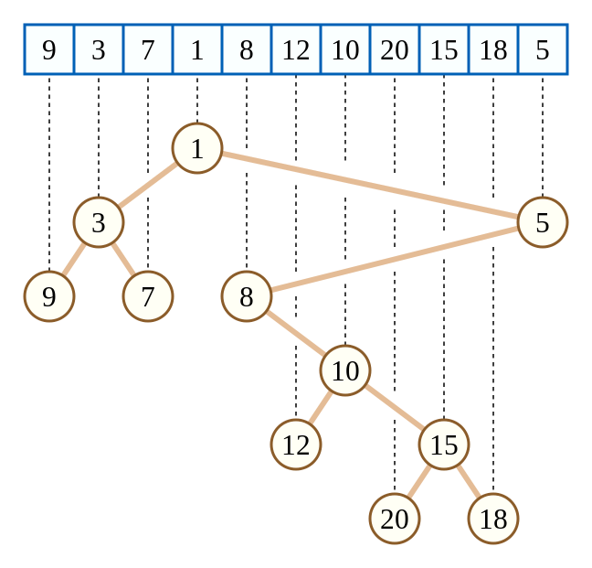

author: sshwy, zhouyuyang2002, StudyingFather, Ir1d, ouuan, Enter-tainer

本文介绍一种不太常用，但是与大家熟知的平衡树与堆密切相关的数据结构——笛卡尔树。

笛卡尔树是一种二叉树，每一个结点由一个键值二元组 $(k,w)$ 构成。要求 $k$ 满足二叉搜索树的性质，而 $w$ 满足堆的性质。一个有趣的事实是，如果笛卡尔树的 $k,w$ 键值确定，且 $k$ 互不相同， $w$ 互不相同，那么这个笛卡尔树的结构是唯一的。上图：



（图源自维基百科）

上面这棵笛卡尔树相当于把数组元素值当作键值 $w$ ，而把数组下标当作键值 $k$ 。显然可以发现，这棵树的键值 $k$ 满足二叉搜索树的性质，而键值 $w$ 满足小根堆的性质。

其实图中的笛卡尔树是一种特殊的情况，因为二元组的键值 $k$ 恰好对应数组下标，这种特殊的笛卡尔树有一个性质，就是一棵子树内的下标是连续的一个区间（这样才能满足二叉搜索树的性质）。更一般的情况则是任意二元组构建的笛卡尔树。

## 构建

### 栈构建

我们考虑将元素按照键值 $k$ 排序。然后一个一个插入到当前的笛卡尔树中。那么每次我们插入的元素必然在这个树的右链（右链：即从根结点一直往右子树走，经过的结点形成的链）的末端。于是我们执行这样一个过程，从下往上比较右链结点与当前结点 $u$ 的 $w$ ，如果找到了一个右链上的结点 $x$ 满足 $x_w<u_w$ ，就把 $u$ 接到 $x$ 的右儿子上，而 $x$ 原本的右子树就变成 $u$ 的左子树。

具体不解释，我们直接上图。图中红色框框部分就是我们始终维护的右链：


显然每个数最多进出右链一次（或者说每个点在右链中存在的是一段连续的时间）。这个过程我们可以用栈维护，栈中维护当前笛卡尔树的右链上的结点。一个点不在右链上了就把它弹掉。这样每个点最多进出一次，复杂度 $O(n)$ 。伪代码如下：

```text
新建一个大小为 n 的空栈。用 top 来标操作前的栈顶，k 来标记当前栈顶。
For i := 1 to n
    k := top
    While 栈非空 且 栈顶元素 > 当前元素 
        k--
    if 栈非空
        栈顶元素.右儿子 := 当前元素
    if k < top
        当前元素.左儿子 := 栈顶元素
    当前元素入栈
    top := k
```

```cpp
for (int i = 1; i <= n; i++) {
  int k = top;
  while (k > 0 && h[stk[k]] > h[i]) k--;
  if (k) rs[stk[k]] = i;  // rs代表笛卡尔树每个节点的右儿子
  if (k < top) ls[i] = stk[k + 1];  // ls代表笛卡尔树每个节点的左儿子
  stk[++k] = i;
  top = k;
}
```

## 笛卡尔树与 Treap

谈到笛卡尔树，很容易让人想到一种家喻户晓的结构——Treap。没错，Treap 是笛卡尔树的一种，只不过 $w$ 的值完全随机。Treap 也有线性的构建算法，如果提前将元素排好序，显然可以使用上述单调栈算法完成构建过程，只不过很少会这么用。

## 例题

HDU 1506 最大子矩形

> 题目大意： $n$ 个位置，每个位置上的高度是 $h_i$ ，求最大子矩阵。举一个例子，如下图：
>
> 
>
> 阴影部分就是图中的最大子矩阵。

这道题你可 DP，可单调栈，但你万万没想到的是它也可以笛卡尔树！具体地，我们把下标作为键值 $k$ ， $h_i$ 作为键值 $w$ 满足小根堆性质，构建一棵 $(i,h_i)$ 的笛卡尔树。

这样我们枚举每个结点 $u$ ，把 $u_w$ （即结点 $u$ 的高度键值 $h$ ）作为最大子矩阵的高度。由于我们建立的笛卡尔树满足小根堆性质，因此 $u$ 的子树内的结点的高度都大于等于 $u$ 。而我们又知道 $u$ 子树内的下标是一段连续的区间。于是我们只需要知道子树的大小，然后就可以算这个区间的最大子矩阵的面积了。用每一个点计算出来的值更新答案即可。显然这个可以一次 DFS 完成，因此复杂度仍是 $O(n)$ 的。

```cpp
#include <algorithm>
#include <cstdio>
#include <cstring>
#include <iostream>
using namespace std;
typedef long long ll;
const int N = 100000 + 10, INF = 0x3f3f3f3f;

struct node {
  int idx, val, par, ch[2];
  friend bool operator<(node a, node b) { return a.idx < b.idx; }
  void init(int _idx, int _val, int _par) {
    idx = _idx, val = _val, par = _par, ch[0] = ch[1] = 0;
  }
} tree[N];

int root, top, stk[N];
ll ans;
int cartesian_build(int n) {
  for (int i = 1; i <= n; i++) {
    int k = i - 1;
    while (tree[k].val > tree[i].val) k = tree[k].par;
    tree[i].ch[0] = tree[k].ch[1];
    tree[k].ch[1] = i;
    tree[i].par = k;
    tree[tree[i].ch[0]].par = i;
  }
  return tree[0].ch[1];
}
int dfs(int x) {
  if (!x) return 0;
  int sz = dfs(tree[x].ch[0]);
  sz += dfs(tree[x].ch[1]);
  ans = max(ans, (ll)(sz + 1) * tree[x].val);
  return sz + 1;
}
int main() {
  int n, hi;
  while (scanf("%d", &n), n) {
    tree[0].init(0, 0, 0);
    for (int i = 1; i <= n; i++) {
      scanf("%d", &hi);
      tree[i].init(i, hi, 0);
    }
    root = cartesian_build(n);
    ans = 0;
    dfs(root);
    printf("%lld\n", ans);
  }
  return 0;
}
```

## 参考资料

 [维基百科 - 笛卡尔树](https://zh.wikipedia.org/wiki/%E7%AC%9B%E5%8D%A1%E5%B0%94%E6%A0%91) 
