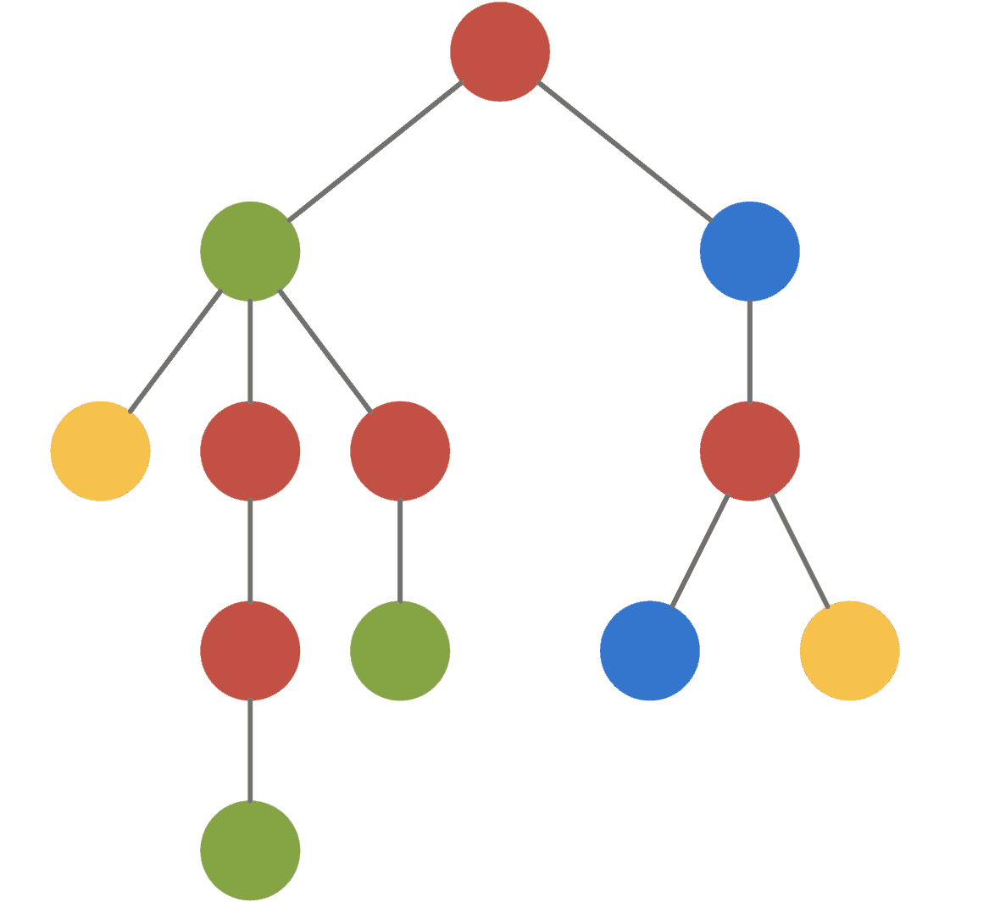
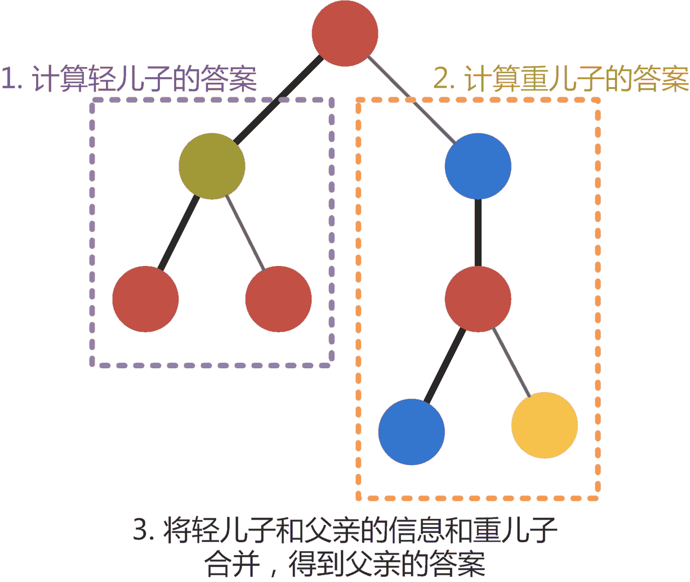
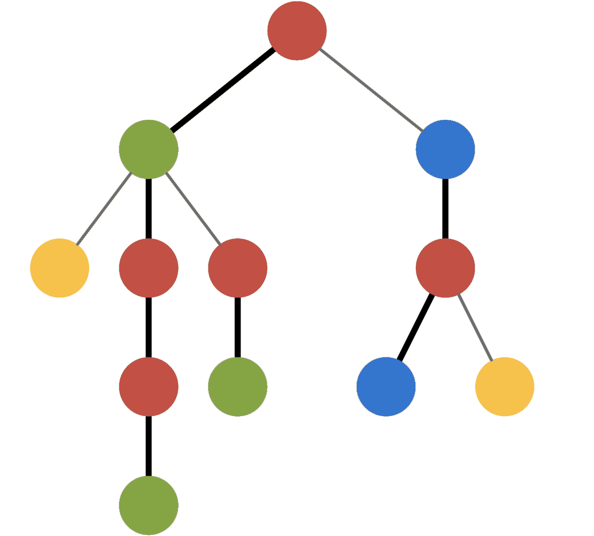

author: abc1763613206, cesonic, Ir1d, MingqiHuang

### 引入

启发式算法是什么呢？

启发式算法是基于人类的经验和直观感觉，对一些算法的优化。

给个例子？

最常见的就是并查集的按秩合并了，有带按秩合并的并查集中，合并的代码是这样的：

```cpp
void merge(int x, int y) {
  int xx = find(x), yy = find(y);
  if (size[xx] < size[yy]) swap(xx, yy);
  fa[yy] = xx;
  size[xx] += size[yy];
}
```

在这里，对于两个大小不一样的集合，我们将小的集合合并到大的集合中，而不是将大的集合合并到小的集合中。

为什么呢？这个集合的大小可以认为是集合的高度（在正常情况下），而我们将集合高度小的并到高度大的显然有助于我们找到父亲

让高度小的树成为高度较大的树的子树，这个优化可以称为启发式合并算法。

### 算法内容

树上启发式合并（dsu on tree）对于某些树上离线问题可以速度大于等于大部分算法且更易于理解和实现的算法。

考虑下面的问题：

给出一棵树，每个节点有颜色，询问一些子树的颜色数量（颜色可重复）。



对于这种问题解决方式大多是运用大量的数据结构（树套树等），如果可以离线，询问的量巨大，是不是有更简单的方法？

树上莫队！

不行，莫队带根号，我要 log

既然支持离线，考虑预处理后 $O(1)$ 输出答案。

直接暴力预处理的时间复杂度为 $O(n^2)$ ，即对每一个子节点进行一次遍历，每次遍历的复杂度显然与 $n$ 同阶，有 $n$ 个节点，故复杂度为 $O(n^2)$ 。

可以发现，每个节点的答案由其子树何其本身得到，考虑利用这个性质处理问题。

我们可以先预处理出每个节点子树的 $size$ 和它的重儿子，重儿子同树链剖分一样，是拥有节点最多子树的儿子，这个过程显然可以 $O(n)$ 完成

我们用 check[i]表示颜色 $i$ 有没有出现过，ans[i]表示他的颜色个数

遍历一个节点，我们按以下的步骤进行遍历：

- 先遍历其非重儿子，获取它的 ans，但 **不保留遍历后它的 check** ；

- 遍历它的重儿子， **保留它的 check** ；

- 再次遍历其非重儿子及其父亲，用重儿子的 check 对遍历到的节点进行计算，获取整棵子树的 ans；



上图是一个例子。

这样，对于一个节点，我们遍历了一次重子树，两次非重子树，显然是最划算的。

通过执行这个过程，我们获得了这个节点所有子树的 ans

为什么不合并第一步和第三步呢？因为 check 数组不能重复使用，否则空间会太大，需要在 $O(n)$ 的空间内完成。

显然若一个节点 $u$ 被遍历了 $x$ 次，则其重儿子会被遍历 $x$ 次，轻儿子（如果有的话）会被遍历 $2x$ 次。

注意除了重儿子，每次遍历完 $check$ 要清零。

### 复杂度

（对于不关心复杂度证明的，可以跳过不看）

我们像树链剖分一样定义重边和轻边（连向重儿子的为重边，其余为轻边）关于重儿子和重边的定义，可以见下图，对于一棵有 $n$ 个节点的树：

根节点到树上任意节点的轻边数不超过 $\log n$ 条。我们设根到该节点有 x 条轻边该节点的子树大小为 $y$ ，显然轻边连接的子节点的子树大小小于父亲的一半（若大于一半就不是轻边了），则 $y<n/2^x$ ，显然 $n>2^x$ ，所以 $x<\log n$ 。

又因为如果一个节点是其父亲的重儿子，则他的子树必定在他的兄弟之中最多，所以任意节点到根的路径上所有重边连接的父节点在计算答案是必定不会遍历到这个节点，所以一个节点的被遍历的次数等于他到根节点路径上的轻边树 $+1$ （之所以要 $+1$ 是因为他本身要被遍历到），所以一个节点的被遍历次数 $=\log n+1$ , 总时间复杂度则为 $O(n(\log n+1))=O(n\log n)$ ，输出答案花费 $O(m)$ .



*图中标红的即为重边，重边连向的子节点为重儿子*

### 大致代码

这里是预处理代码

```cpp
void dfs1(int u, int fa) {
  size[u] = 1;
  for (int i = head[u]; i; i = tree[i].next) {
    int v = tree[i].v;
    if (v != fa) {
      dfs1(v, u);
      size[u] += size[v];
      if (size[v] > size[son[u]]) son[u] = v;
    }
  }
}
```

下面是求答案的代码

```cpp
int dfs2(int u, int fa, bool keep, bool isson) {
  int tmp = 0;
  for (int i = head[u]; i; i = tree[i].next) {
    int v = tree[i].v;
    if (v != fa && v != son[u]) {
      dfs2(v, u, 0, 0);
    }
  }
  if (son[u]) tmp += dfs2(son[u], u, 1, 1);
  for (int i = head[u]; i; i = tree[i].next) {
    int v = tree[i].v;
    if (v != fa && v != son[u]) {
      tmp += dfs2(v, u, 1, 0);
    }
  }
  if (!check[color[u]]) {
    tmp++;
    check[color[u]] = 1;
  }
  if (!keep || isson) ans[u] = tmp;
  if (!keep) memset(check, 0, sizeof(check)), tmp = 0;
  return tmp;
}
```

代码是我口胡出来的，因为没有经过测评不保证正确。

### 运用

1. 某些出题人设置的正解是 dsu on tree 的题

如 [CF741D](http://codeforces.com/problemset/problem/741/D) 。给一棵树，每个节点的权值是'a' 到'v' 的字母，每次询问要求在一个子树找一条路径，使该路径包含的字符排序后成为回文串。

因为是排列后成为回文串，所以一个字符出现了两次相当于没出现，也就是说，这条路径满足 **最多有一个字符出现奇数次** 。

正常做法是对每一个节点 dfs，每到一个节点就强行枚举所有字母找到和他异或后结果为 1 的个数大于 1 的路径，再取最长值，这样是 $O(n^2\log n)$ 的，可以用 dsu on tree 优化到 $O(n\log^2n)$ 。关于具体做法，可以参考下面的扩展阅读

2. 可以用 dsu 乱搞的题

可以水一些树套树的部分分（没有修改操作），还可以把树上莫队的 $O(n\sqrt{m})$ 吊着打

### 练习题

 [CF600E Lomsat gelral](http://codeforces.com/problemset/problem/600/E) 

题意翻译：树的节点有颜色，一种颜色占领了一个子树，当且仅当没有其他颜色在这个子树中出现得比它多。求占领每个子树的所有颜色之和。

 [UOJ284 快乐游戏鸡](https://uoj.ac/problem/284) 

### 参考资料/扩展阅读

 [CF741D 作者介绍的 dsu on tree](http://codeforces.com/blog/entry/44351) 

 [这位作者的题解](http://codeforces.com/blog/entry/48871) 
